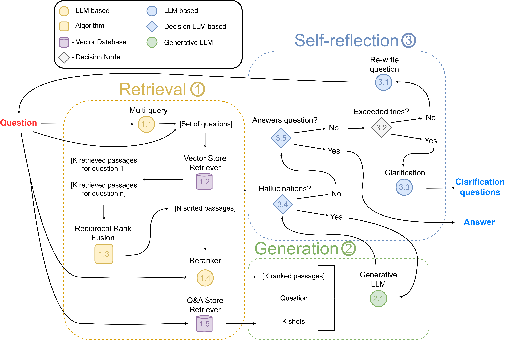
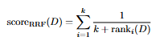
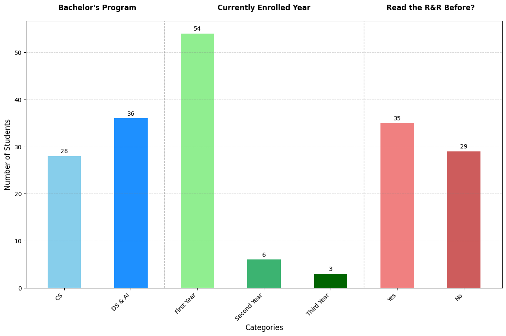

<h1><p align="center">Generative AI-Based Virtual Assistant Using Retrieval-Augmented Generation:
An evaluation study for bachelor projects</p></h1>

## Abstart
Large Language Models have been increasingly employed
in the creation of Virtual Assistants due to their ability to generate
human-like text and handle complex inquiries. While these models hold
great promise, challenges such as hallucinations, missing information,
and the difficulty of providing accurate and context-specific responses
persist, particularly when applied to highly specialized content domains.
In this paper, we focus on addressing these challenges by developing a
virtual assistant designed to support students at Maastricht University
in navigating project-specific regulations. We propose a virtual assistant
based on a Retrieval-Augmented Generation system that enhances the
accuracy and reliability of responses by integrating up-to-date, domain-
specific knowledge. Through a robust evaluation framework and real-life
testing, we demonstrate that our virtual assistant can effectively meet
the needs of students while addressing the inherent challenges of applying
Large Language Models to a specialized educational context. This work
contributes to the ongoing discourse on improving LLM-based systems
for specific applications and highlights areas for further research.

## Installation

**Python Version:** 3.10.11

To install the required packages, run the following command:

```bash
pip install -r requirements.txt
```

`showcase_notebook.ipynb` contains a showcase of the virtual assistant in action.

## Methods


Figure 1: The VA architecture consists of retrieval, generation, and self-reflection
parts. Retrieval ① collects the relevant information to the user question. Generation ② processes the retrieval information and structures it to generate the
response. Self-reflection ③ is the fallback mechanism that ensures the correctness
of the response and understanding of the user question.

The following section details the architecture, processes, and methodologies
employed in the VA pipeline (see Figure 1). The VA pipeline receives a user
question as input to the retrieval pipeline Figure 1.1. The retrieval pipeline
collects all necessary information such as relevant document chunks and similar
Question and Answer (Q&A) examples to the user question, and then sends
all collected information to the generation pipeline Figure 1.2. The generation
pipeline organizes the information from the retrieval phase and generates the
response with a set of instructions, which it then sends to the self-reflection part
Figure 1.3.

The self-reflection part is our fallback mechanism, which evaluates the generated
response for hallucinations and relevance. If one part of self-reflection fails, it
attempts to correct itself or asks for clarifications from the user. The detailed
mechanisms of the VA pipeline are discussed later in this paper, with numerical
references as illustrated in Figure 1. 3

Retrieval-Augmented Generation: RAG is a technique that combines the strengths
of both retrieval-based and generation-based methods. This hybrid method
involves retrieving relevant documents from a large corpus and using this in-
formation to generate more accurate and contextually enriched responses.
The integration of RAG allows our VA to access up-to-date information, thus
overcoming the temporal limitations of static pre-trained models.

### ① Retrieval Pipeline

The retrieval pipeline is a fundamental component of our VA system, designed
to efficiently retrieve relevant information from a corpus of documents.

**Multi-Query Retrieval 1.1:** Multi-query retrieval enhances the retrieval process
 by generating multiple versions of a user query, capturing different perspectives,
and ensuring a broader range of relevant documents. This approach leverages
LLMs to create alternative queries, improving the accuracy and comprehensiveness
of the VA’s responses by considering diverse and contextually relevant documents.


Prompt:
```
You are an AI language model assistant. Your task is to generate 
3 different versions of the given user question to retrieve relevant 
documents from a vector database. By generating multiple perspectives 
on the user question, your goal is to help the user overcome some of 
the limitations of distance-based similarity search. Provide these 
alternative questions separated by newlines.
Original question: {question}
```

**Vector Database 1.2:** The vector database is the whole basis of our retrieval
system, enabling efficient storage and retrieval of document embeddings.
The embedding model transforms documents and queries into dense vector
representations, ensuring quick and accurate retrieval of relevant documents
based on similarity metrics such as cosine similarity, maximal marginal relevance
(MMR), etc.

**Embedding Techniques:** Embedding techniques are crucial for converting text
into numerical vectors that models can understand and manipulate. We can
use advanced embedding models from Google, OpenAI, Mistral, or
BGE to generate high-quality numeric text representation. These embeddings
capture semantic meanings and relationships within the text, which is essential
for both the retrieval and generation phases.

**Reciprocal Rank Fusion 1.3:** Reciprocal Rank Fusion (RRF) is a method used
in RAG to combine and rerank documents from multiple retrieval queries. By
assigning a score to each document based on its ranking across various result
lists, RRF effectively consolidates different retrieval outputs. The formula for
RRF is given by:


<p align="center">
  
</p>


where rank_i(D) is the rank of document D in the i-th result list, and k is a small
constant, often set to 60. This method enhances retrieval accuracy by emphasizing
higher-ranked documents while maintaining robustness against discrepancies in
individual list rankings.

**Reranker 1.4:** The reranker model is used to obtain a better relevance score
between a question and a document. There are two different types of reranked
models:
– Cross-encoder model uses both the question and the document as inputs and
directly outputs a similarity score, rather than generating embeddings.
– LLM-Embedder, unlike embeddings, which primarily assess semantic similarity
between a document and a query, the LLM-Embedder can provide precise
scores for how well a document answers a given query using fine-tuned
generative LLMs.

**Few-shot retriever 1.5:** Since we have already received a Q&A dataset from
the bachelor’s project coordinator, storing them in the Vector Store allows us
to retrieve similar questions and example truth answers to provide few-shot
examples to our generative LLM, thereby giving example answers to the question.

### ② Generation Pipeline

In the generation process of a VA, using low-temperature 0.2 and structured
XML prompts helps to improve
answer accuracy and factual grounding. Low temperatures reduce randomness,
leading to more conservative and reliable responses, while structured XML
prompts facilitate better input understanding and contextual relevance by clearly
defining different elements of a prompt. This combination ensures that the **LLM
2.1** generates responses that are consistent and closely aligned with the provided
facts. Moreover, this technique optimizes the VA’s functionality in handling
detailed and complex queries.

Prompt:
```
Use the following pieces of context to answer the question at the end.
If you don't know the answer, just say that you don't know, don't try to 
make up an answer. Always give references to the generated answer
(document\_name/article/page, e.g. "Reference: Rules and Regulation/article: 5.1.1 /page: 20.)
along with the provided information, there can be multiple references.
Additionally, try to avoid contact with Board of Examiners (BoE), 
and if you have to, make sure to suggest first contact the project coordinator.

<Previous Questions>
...
</Previous Questions>

<Context>
...
</Context>

<Question>
...
</Question>

Use all context to generate a helpful, detailed and structured response with references.
Helpful Answer:
```

### ③ Self-Reflection Pipeline
The self-reflection process is about assessing and refining the response generated
by the VA to obtain accuracy and relevance. Here’s how it functions:

– **Re-write Question 3.1:** If the generated answer is not satisfactory, or if it
does not directly address the user’s query, the process includes a mechanism
to rewrite the query. This might involve rephrasing, correcting, or breaking
down the question into more manageable parts to better match the available
data. By rephrasing the question, the VA can better match the query with relevant documents 
in the database, leading to more accurate responses.


System Prompt:
```
You are question re-writer that converts an input question to a better 
version that is optimized for vectorstore retrieval. Look at the input 
and try to reason about the underlying semantic intent / meaning.
```
User Prompt:
```
Here is the initial question: 

{question}

Formulate an improved question.
```

– **Exceeded Tries 3.2:** This checks whether the process of rewriting the question
has exceeded a set number of tries. If so, it indicates that the system is
struggling to understand the query or to find relevant information, and a
different approach might be needed such as clarification questions.

– **Clarification Questions 3.3:** If necessary, the system can pose clarification
questions to the user. This step is especially important when the query is
ambiguous or lacks specific details needed for an accurate response. By engaging the 
user in a dialogue, the VA can gather additional information to better address the 
user's needs.

System Prompt:
```
You are a clarification model. Your task is to generate questions of 
the given user question and context to understand better his question.
By generating multiple clarification perspectives on the user question 
and context, your goal is to help the user overcome some of the limitations 
of distance-based similarity search, without asking additional information. 
Provide these alternative questions separated by newlines.
```
User Prompt:
```
Set of context:

{context}

User:

{query}

Clarification questions:
```

– **Hallucinations 3.4:**  Hallucination detection is important to ensure that the VA's 
responses are accurate and based on the retrieved information. Generative models can sometimes 
produce plausible-sounding but incorrect or confabulate content, known as hallucinations. To 
mitigate this, the VA employs a Generative LLM as a decision-maker to evaluate the generated 
answer against the retrieved documents.

The hallucination detection mechanism works by comparing the response to the set of facts 
obtained during the retrieval phase. The Generative LLM uses a specific prompt to determine
whether the answer is grounded in the provided facts. If the LLM determines that the answer 
contains information not supported by facts, it requests Generative LLM 2.1 to regenerate the
response until the Hallucination Check produces a satisfactory result.

System Prompt:
```
You are a grader assessing whether an LLM generation is grounded in / supported by 
a set of retrieved facts. Give a binary score 'yes' or 'no'. 'Yes' means that the 
answer is grounded in / supported by the set of facts.
```
User Prompt:
```
Set of facts:

{documents}

LLM generation: {generation}
```

**Answer Check 3.5:** This involves verifying whether the generated response adequately addresses
the user's question. The system employs a Generative LLM as a decision-maker to determine if the 
answer resolves the query. If the answer is found lacking, the system may trigger the query rewriting 
mechanism or ask for clarification from the user.

System Prompt:
```
You are a grader assessing whether an answer addresses / resolves a question
Give a binary score 'yes' or 'no'. Yes' means that the answer resolves the question.
```
User Prompt:
```
User question:
 
{question}

LLM generation: {generation}
```


## Survey

### Questions at the Start
- In which program are you enrolled? (Computer Science or Data Science & AI)
- What year are you currently in? (Year 1, 2, or 3)
- Have you ever read rules and regulations? (Yes or No)
- Do you know how many project meetings you can skip for each phase? Provide an explanation of the allowed absences per phase.
- Do you know what constitutes a case of force majeure to miss a project meeting or a skill class? Define force majeure and provide examples that are considered valid.

***The survey revealed varied levels of understanding among participants regarding the rules for skipping project meetings. However, based on the responses, the groups showed similar prior knowledge based on the last three questions.***

---
### Scenarios

*The correct answers are shown in **bold**. Please note that the option "I don't know" is hidden in these scenarios but was presented in the survey.*

#### Scenario 1
Mark regularly attended all project meetings until, due to an unexpected health issue, he had to miss two consecutive meetings in Phase 3. He couldn't obtain a medical certificate in time and informed his tutor only after missing the meetings. What happens in this situation?

**Answers:**
- No Grade (NG)
- **Lower individual grade**
- No impact
- Immediate failure of the entire project
---
#### Scenario 2
Ana already missed one project meeting in Phase 3 due to a scheduled medical appointment, and now she had to miss another one for unplanned medical care. She provided documentation for both absences. What happens in this situation?

**Answers:**
- There is no problem, as 1 is covered by force majeure, and missing 1 meeting is allowed.
- **There is a problem, as Ana needs to prove that both events were force majeure.**
---
#### Scenario 3
Luca carefully planned his day to arrive on time for the final product and report examination. However, the bus he took left the stop earlier than scheduled, causing him to miss the exam. Now he is worried about his project grades. What are the consequences for his project grades?

**Answers:**
- **He will receive a NG for the project.**
- He will receive the same grade as everyone else in the team.
- He will receive a lowered individual grade for the project.
---
#### Scenario 4
Maria had her final product and report examination scheduled for today, but she had to go urgently to the doctor for unplanned medical care. She informed her tutor and provided medical documentation. What are the consequences for her project and individual grades?

**Answers:** 
Exactly the same as in Scenario 3, apart from the gender change. The correct answer is that she receives a NG for the project.
---
#### Scenario 5
Emma's group was excellent; they completed all skill classes, project meetings, and examination moments. However, they all missed the pre-examination moment in Phase 3. What will the consequences be for their grades?

**Answers:**
- They will all receive a NG.
- They will all receive a 0.
- **There are no consequences.**
---
#### Scenario 6
Alex has been actively participating in all project activities except for the final presentation, which he missed due to a job interview. He informed his group but did not notify his tutor. What should he expect regarding his final grade?

**Answers:**
- **He will get a 0 for the presentation.**
- He will need to provide proof of the job interview to avoid a penalty.
- He will receive a warning but no grade penalty.
---
#### Scenario 7
During the project, David noticed that one of his group members, Lisa, has not been participating actively and missed several meetings without any valid reason. David and the rest of the group are concerned about the impact on their project. What should they do?

**Answers:**
- Try to motivate Lisa to participate more actively.
- Do nothing and hope the situation improves.
- **Report Lisa’s lack of participation to the project tutor for intervention.**
---
#### Scenario 8
Michael's father is getting married on a day when Michael has a project meeting. He has already skipped a previous meeting due to illness. He managed to inform his tutor on time and provide a wedding invitation. Can he go to his father's wedding without any consequences for his absence?

**Answers:**
- **Yes, but only if the wedding and previously missed project meeting were in different phases.**
- No, if he goes to the wedding he will directly receive a NG for the project, no matter what phase the previously missed meeting was in.
- Yes, even if the wedding and previously missed project meeting were in the same phase.
---
### Questions at the End

- **"How was the response time?"** *(1 = "Worse than expected", 5 = "Better than expected")*
- **"Do you think that we developed a valuable VA? By valuable, we mean that it can reduce staff members' workload and increase response time for students."** *(1 = "Not valuable at all", 5 = "Extremely valuable")*
- **What functionality would you like to see added in a new version of the VA?**
- **Do you have any other comments/questions about this questionnaire/VA?**
---
## Survey Analysis

Figure 1 shows the results of questions that were asked regarding the general information (the year and the program they are enrolled in and whether they have read the rules and regulations before or not).

The chart indicates that most participants are enrolled in the Data Science & AI program, with 54 students in their first year, 6 in their second year, and 3 in their third year. Additionally, 35 students reported having read the rules and regulations, while 29 had not.



---
## Open-ended Feedback from Students

At the end of the survey, we asked the participants about possible future functionality additions and if they had any other comments/questions about the survey or VA. A summary of both responses can be found in the sections below.

### Future Functionality Suggestions

Students commonly suggested the following features to be added in the future:

1. More concise answers or first a concise answer and then a detailed explanation.
2. Adjust frequently asked questions on the home page.
3. Give the contact information of the coordinator.
4. Give force majeure template for Board of Examiners.

*Discussion:* The first suggestion is understandable, but in practice, students might prefer an answer that applies specifically to their situation, which may be longer. The other suggestions have been implemented. The last two suggestions could be implemented as a user-interface shortcut where students can click on what they need and directly get the information.

Other functionality proposals that require more security/system clearance from Maastricht University are:

- Student login for student information with chat history.
- Reminder for project meetings and examination moments.
- Help with course registration.
- Provide files to check with force majeure.
- Timetable for opening times of the buildings, holidays, exchange universities, course information, requirements to graduate cum laude/honours, how thesis semester works.
---
### Other Questions or Feedback from Participants

Students generally wrote in this section that they were happy with such a system, which is in line with our previous findings. Furthermore, there were a few comments:

1. *"I like the idea of helping students, but I find it kind of ridiculous that these rules and regulations are so complicated that we need an AI to understand them, which is not your fault at all!"*
2. *"Wouldn't it be easier to just have a PDF or a centralized location with clear definitions and scenarios than needing an assistant? And is this really taking up that much time of the coordinator?"*


